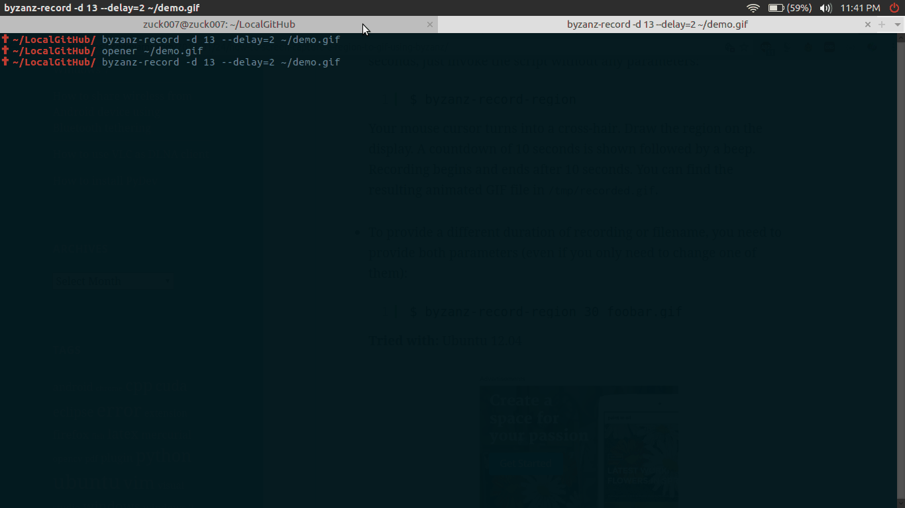

## Starboy  [](https://raw.githubusercontent.com/zuck007/Starboy/master/LICENSE)
> A simple zsh-theme
## Installation
* Install [oh-my-zsh](https://github.com/robbyrussell/oh-my-zsh#basic-installation)
* follow these steps:
```
$ cd ~/.oh_my_zsh/themes/
$ wget https://raw.githubusercontent.com/zuck007/Starboy/master/starboy.zsh-theme
$ # edit ~/.zshrc and set ZSH_THEME="starboy"
```
## Related
* Install [xplay](https://github.com/zuck007/xplay#xplay) if you want to use `alias weeknd='xplay -a weeknd'`
## Screenshot

